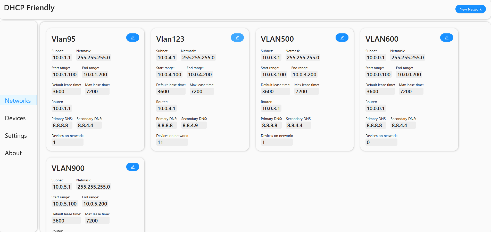
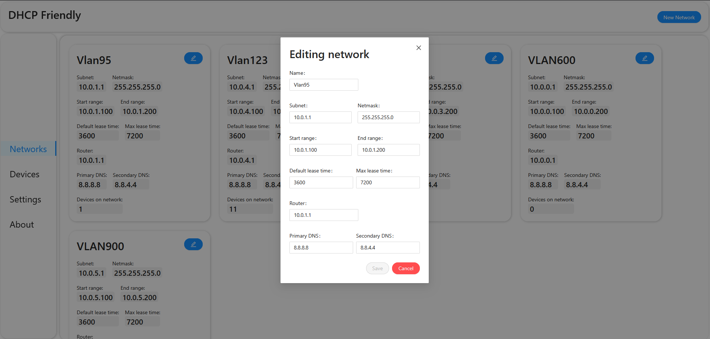
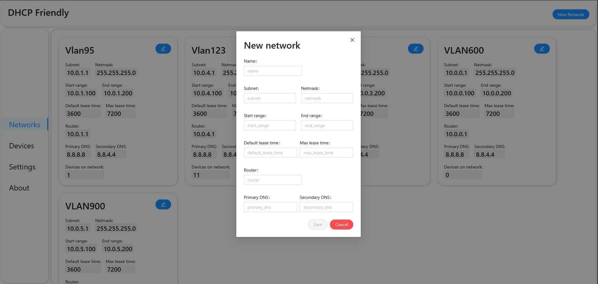
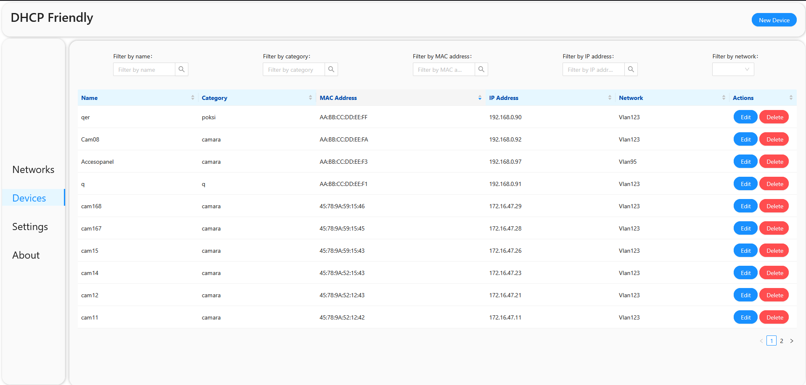
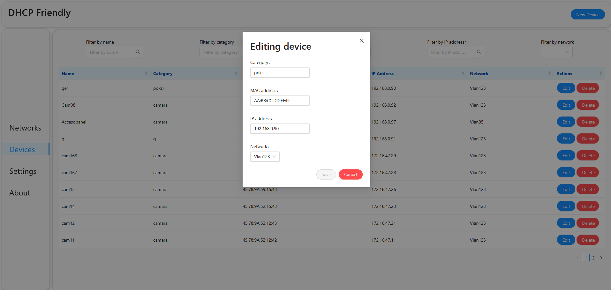
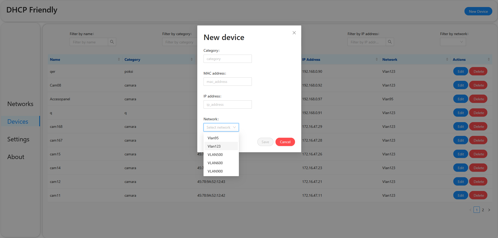
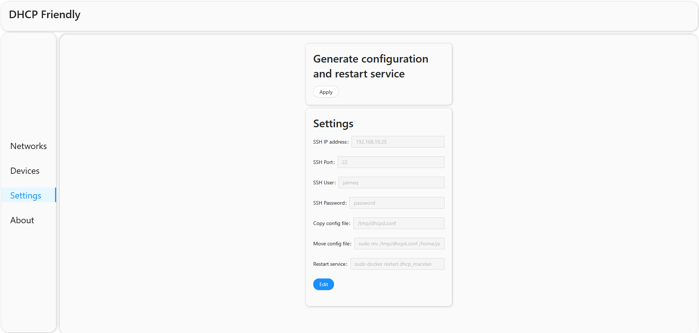
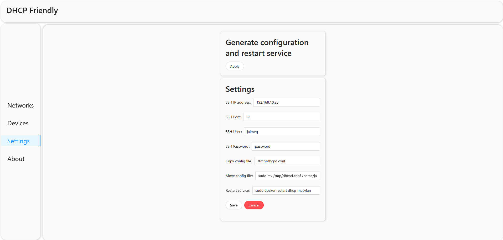
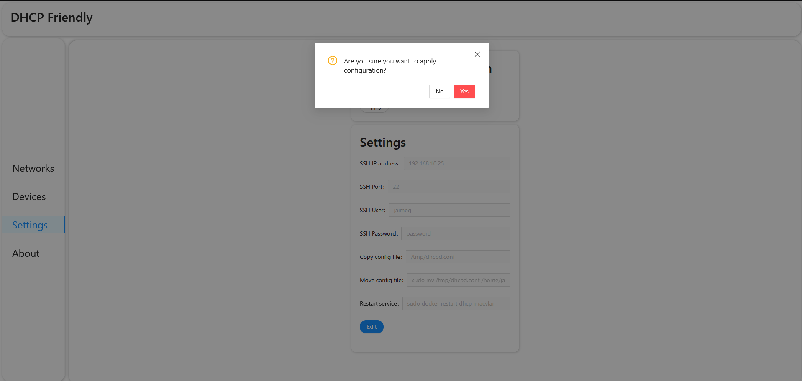

# FriendlyDHCP – DHCP Configuration Manager

Aplicación web desarrollada en **Angular** para la administración de redes y dispositivos, con generación automática del archivo `dhcpd.conf` y despliegue hacia un servidor Linux.

El sistema permite gestionar redes, reservas de dispositivos (MAC + IP fija) y aplicar la configuración directamente al servidor DHCP mediante SSH, automatizando completamente el proceso de edición manual del archivo de configuración.

---

Tecnologías utilizadas

- **Angular**
- **TypeScript**
- **Angular Signals** (`signal`, `computed`, `effect`)
- **Ng-Zorro Ant Design**
- **Reactive Forms**
- **Docker**
- **Nginx (producción)**
- Backend propio en **Java + Spring Boot**

---

## Funcionalidades

### Gestión de Redes (Subnets)

- Crear múltiples redes
- Configurar:
  - Subnet
  - Netmask
  - Rango de IP
  - Router
  - DNS primario/secundario
  - Lease time
- Edición mediante modal
- Validación de formato
- Prevención de duplicados




---

### Gestión de Dispositivos 

- Registro de dispositivos con:
  - Nombre
  - Categoría
  - Dirección MAC
  - Dirección IP fija
  - Red asociada
- Validación de formato MAC (regex)
- Validación de IP duplicada
- Limpieza de caracteres inválidos
- Confirmación antes de eliminar




---

El sistema genera automáticamente el archivo `dhcpd.conf` basado en la información almacenada en base de datos.

#### Flujo:

1. El frontend llama al endpoint `/configuration/apply`
2. El backend:
  - Genera el archivo `dhcpd.conf`
  - Lo copia vía SSH a un servidor Linux
  - Ejecuta el comando configurado (ej. reiniciar contenedor Docker del DHCP)
3. Devuelve respuesta de éxito/error
4. El frontend muestra notificación 

Antes de ejecutar, existe confirmación modal para evitar errores accidentales.




---

## Validaciones 

El sistema previene errores comunes mediante:

- Validación de formato MAC
- Validación de formato IP
- Prevención de duplicados:
  - MAC duplicada
  - IP duplicada
  - Nombre duplicado
- Limpieza de caracteres
- Confirmación antes de eliminar registros
- Confirmación antes de aplicar configuración

---

## Arquitectura 

Estructura basada en separación de responsabilidades:

```
app
├── components
│ ├── devices-form-modal-component
│ ├── devices-table-component
│ ├── network-cards-component
│ ├── network-form-modal-component
│ ├── side-bar-menu-component
│ └── top-bar-component
├── models
│ ├── Device.ts
│ ├── Network.ts
│ ├── DTOs
│ └── ApiError.ts
├── pages
│ ├── devices-page
│ ├── networks-page
│ ├── settings-page
│ └── about
└── service
├── device-api.service.ts
├── network-api.service.ts
├── config-api.service.ts
├── app-modal.service.ts
└── api-url-base.service.ts
```
### Principios aplicados

- Separación entre UI y acceso a datos
- Componentes desacoplados
- Uso de Signals para estado reactivo
- Formularios reactivos
- Observables para comunicación HTTP
- Feedback visual mediante notificaciones
---
## Despliegue

- Construcción del frontend con Docker
- Servido mediante Nginx
- Desplegado en servidor Linux
- Red interna empresarial

> NOTA: El backend (Spring Boot) se ejecuta de forma independiente.

## ▶ Cómo ejecutar el frontend

```bash
git clone <repo>
cd friendlydhcp
npm install
ng serve
```


